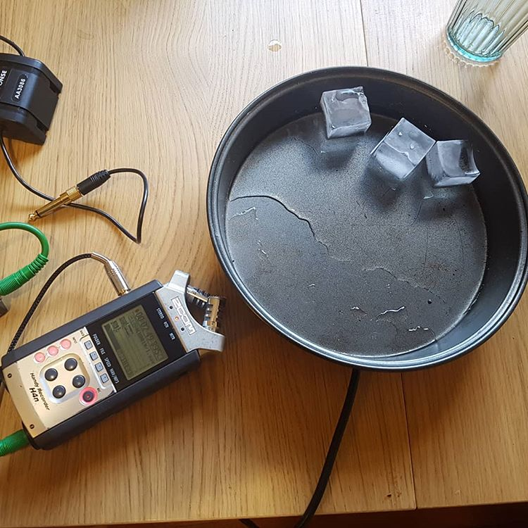
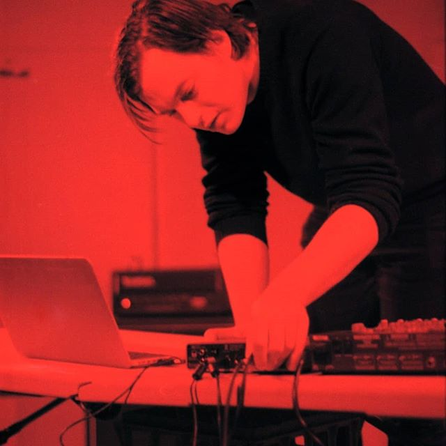

As well as pursuing my arts practice I work as a freelance collaborator on a variety of arts-related projects.

## Some projects I have worked on:

#### Oompah! @ Artplay (2018)

<iframe width="560" height="315" src="https://www.youtube.com/embed/sQamogAeVo0" frameborder="0" allow="accelerometer; autoplay; encrypted-media; gyroscope; picture-in-picture" allowfullscreen></iframe>

**Role:** Interaction design, programming, sound design, composition. 

#### Great Movements of Feeling @ Gertrude Contemporary (2018)

<iframe src="https://player.vimeo.com/video/288865428?title=0&byline=0&portrait=0" width="640" height="360" frameborder="0" allow="autoplay; fullscreen" allowfullscreen></iframe>

Work: Helen Grogan, *splitting open the surface on which it is inscribed*, 2018

<https://www.greatmovementsoffeeling.com/exhibition>

**Role:** Sound Recordist, Mixer

#### Anticipation is half of the seduction @ Blindside (2018)

Exhibition Site: 
<https://www.blindside.org.au/emerging-curator-mentorship-2018>

**Role:** Sound Recordist, Consultant, Mixer

 

## Primary Skill Sets

#### Location Sound Recordist:

With a  wide array of microphones and professional field recording equipment, I am able to capture and record the best possible audio needed for your project on site. 

#### Specialist Sound Recording

For my own practice and in collaboration, I have a special interest in capturing hard to record or uncommon sound sources.

### Recording body sounds

For previous clients I have recorded heart, lung and body sounds, electromagnetic resonances from computers and phones and internal sounds picked up through transduction. 

### Recording melting ice

#### Interaction Design and Programming

With a particular knowledge of popular creative arts programming languages such as Max/MSP, Arduino, Processing and p5.js, I can construct a custom tailored interface for your next project.

For past clients I have built MIDI routers, interactive sound sculptures and custom hardware solutions to help them achieve their creative and practical needs.  

#### Live Sound

Coming from a background in Sound Art, my passion lies in creating a mood and atmosphere that helps foreground the source material in a physical space. This often means making decisions on site and in the planning process that will facilitate this.

I have mixed live gigs, experimental art performances and theatre productions.

#### Mixing and Sound Design

As well as capturing sound on site, I can provide mixing facilities and post-video sync work for small scale projects or individual clients. 

#### Contact

If I could help with any or all of these, please feel free to [email](mailto:liamfpower@gmail.com), or fill out the contact form below with your enquiry. Lets work something out!

<form id="contactform" action="https://formspree.io/xyyyogaj" method="POST">
    

        <input class="mywidth" type="text" name="name" placeholder="Name">
    

    

        <input class="mywidth" type="email" name="_replyto" placeholder="Email" cols="2">
    

    

        <textarea id="messagebox" name="message" placeholder="Tell me about your project and how I can help."></textarea>
    

    

        <input type="submit" value="Send">
    

</form>

